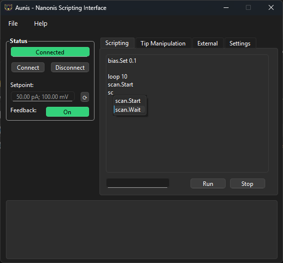

# Aunis - Nanonis Scripting Interface

Aunis is a control and scripting interface in Python designed for automating measurements within the [Nanonis Mimea™ SPM control system](https://www.specs-group.com/nanonis/products/mimea/).

**System Requirements**

A Nanonis Mimea system with the programming interface enabled.

**Key Features**

**Command system with mapping functionality:**

- Command names written in scripts are mapped to Python functions or class methods.
- Supported functions can be:
    - Provided by the Python Interface Package for Nanonis (nanonis_spm).
    - Custom, self-implemented functions for more complex tasks.
- Extensibility:
    - New commands can be easily added.
    - No direct programming language knowledge is required.
- Script execution:
    - Syntax check is performed before script execution to ensure correctness.
    - Supports nested loops for advanced automation routines.
    - Autocomplete feature assists while writing scripts, suggesting available commands.
- Integration with external systems:
    - Supports connections to external TCP interfaces.
    - Allows sending of custom commands to both Nanonis and external devices.


**Version Information**

Current version: 0.41

Release date: 28.08.2025

**Graphical User Interface**



## Installation
Clone the Github repository using

<code>git clone https://github.com/noisyn/Aunis</code>

## Dependencies
Aunis requires the following libraries:
- numpy
- scipy
- PySide6
- nanonis_spm

## Documentation
A user manual can be found here: [Manual](manual/manual.pdf).

### Example

This example demonstrates how to perform a repeated scan sequence with incremental bias voltage changes:

- Set the initial bias voltage to 0.1 V.
- Scan an image using the current bias voltage.
- Increase the bias voltage by +0.1 V.
- Wait for 10 seconds.
- Repeat steps 2–4 a total of 10 times.

```
bias.Set 0.1

loop 10
scan.Start
scan.Wait
bias.Add 0.1
wait 10
end
```

This example demonstrates how to use nested loops in Aunis to automate repeated measurements:
```
bias.Set 0.1
current.Set 50e-12

loop 10
   loop 5
   scan.Start
   scan.Wait
   current.Add 50e-12
   end
current.Set 50e-12
bias.Add 0.1
end
```

### External TCP Interface
**Function:** Provides an overview of the external TCP interfaces. The TCP interface allows to **send commands to other devices** over a network using the TCP protocol. This enables to mix **local function calls** with **remote device control** inside the same script. 

### Adding New Functions to the Command System
#### Structure of a Registry Entry

The **command system** works by mapping **command names** (the text the user writes in the script) to Python functions or class methods. These can be functions or class methods provided by the **Python Interface Package for Nanonis (nanonis_spm)**, or custom, self-implemented functions for more complex tasks.

This mapping is stored in the **FUNCTION_REGISTRY**, where each entry describes:
- Which function to call
- What arguments it expects
- Which arguments are user-provided vs. default
- How arguments should be converted (type casting)

```python
FUNCTION_REGISTRY = {
    "command_name": {
        "func": <function_or_method_reference>,
        "args": {
            "arg1_name": {
                "type": <Python_type>,
                "default": <default_value>,
                "user": <True_or_False>
            },
            "arg2_name": {
                "type": <Python_type>,
                "default": <default_value>,
                "user": <True_or_False>
            },
            ...
        }
    }
}
```

**Explanation of fields:**

**command_name:**
- The text the user must type in the script to call this function.

**func:**
- A reference to the function or method to be executed.
- Nanonis commands are made available via the **Python Interface Package for Nanonis**.
- For standalone functions: just use the function name (e.g. complexTask).
- For class methods: use the **unbound method** (e.g. nanonis_spm.Nanonis.Bias_Set).
    - The system will automatically inject the correct instance from INSTANCE_MAP. The INSTANCE_MAP is a lookup table that maps class names to specific pre-created objects, so that the parser knows which instance to use when executing class methods.

**args:** (dictionary of arguments)
Defines the **arguments** required by the function and their respective **data types**.
Each argument must define:
- **"type":** Python data (numpy) type used to convert the user input (e.g. np.int, np.float32). 
- **"default":** Value used if this argument is not provided by the user.
- **"user":** 
    - True → user must provide this argument in the script.
    - False → argument is filled automatically with the default.

Functions and argument definitions for Nanonis commands follow the **Nanonis TCP protocol**.
Arguments are always read **in the dictionary order**.

#### Examples

These commands are based on Nanonis functions that are provided via the TCP protocol.
```python
"lockin.PhaseSet": {
    "func": nanonis_spm.Nanonis.LockIn_DemodPhasSet,
    "args": {
        "Demodulator number": {"type": np.int32, "default": 1, "user": False},
        "Phase (deg)": {"type": np.float32, "default": 0.0, "user": True},
    },
}
```

```python
"drift.Set": {
    "func": nanonis_spm.Nanonis.Piezo_DriftCompSet,
    "args": {
        "Compensation status": {"type": np.uint32, "default": 1, "user": True},
        "Vx (m/s)": {"type": np.float32, "default": 0.0, "user": True},
        "Vy (m/s)": {"type": np.float32, "default": 0.0, "user": True},
        "Vz (m/s)": {"type": np.float32, "default": 0.0, "user": True},
        "Saturation limit (%)": {"type": np.float32, "default": 10.0, "user": False},
    },
}
```

This command is based on a custom, self-implemented function.
```python
"bias.Add": {
        "func": ScriptingInterface.addBias,
        "args": {
            "Bias value (V)": {"type": np.float32, "default": 0.1, "user": True},
        },
    }
```
#### Adding a Remote Command

All external devices are defined in the **TCP_INTERFACES** dictionary.
```python
TCP_INTERFACES = {
    "QuPe": {"host": "192.168.1.10", "port": 1337},
}
```
**Multiple TCP interfaces** can be managed via **TCP_INTERFACES**. Each remote command specifies which interface to use.

The **TCPClient class** handles communication. It has two methods:
1.	**send(command, args)**
    - Sends a command with arguments to the device.
    - Fire-and-forget (does not wait for a response).
2.	**query(command, args)**
    - Sends a command with arguments to the device and waits for a response.
    - Expected format from the device: error|response|variable1,variable2
        - "None" for empty values

Remote commands are added to the **FUNCTION_REGISTRY** just like local ones. Functions are implemented as lambda calling.
1.	Decide a **command name** (e.g., " QuPe.FreqSet").
2.	Create a **lambda function** that calls TCPClient(interface_name).send(...).
3.	Define **arguments** in the same style as local commands.

**Example:**
```python
"QuPe.FreqSet": {
    "func": lambda freq: TCPClient("QuPe").send("setFrequency", [freq]),
    "args": {
        "Frequency (Hz)": {"type": np.float32, "default": 1e9, "user": True},
    },
}
```
- **freq** is the user-supplied argument.
- Defaults are used if user=False.
- The TCP client sends the command **”setFrequency [freq]” (setFrequency 1e9)** to the interface QupE.

## License
This project is licensed under the [MIT License](LICENSE).